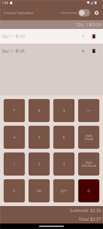
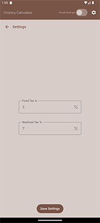

## Grocery Calculator

This is a calculator for those on a tight budget to use while shopping. What this app does, is to allow the user to input price amounts and either add as a Food item or a Nonfood item as these are usually taxed differently. These taxes are not automatic and will have to be specified in the Settings Dialog.

|Cleared Calculation|Sample Calculation|Settings Creen|
|-------------------|------------------|--------------|

<figure><figcaption>Cleared Calculation</figcaption></figure>&nbsp;&nbsp;&nbsp;&nbsp;
